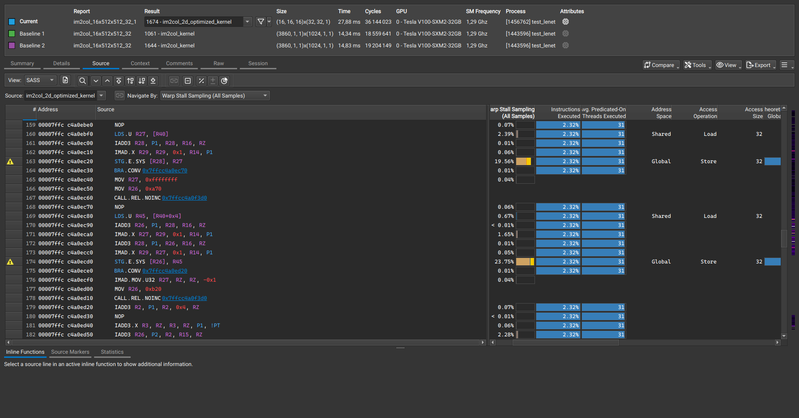

# LeNet

A pure CUDA implementation for classical CNN LeNet.

## Architecture


## Kernels

### Convolution

```cpp
void conv_forward(size_t N, size_t M, size_t C, size_t H, size_t W, size_t K, float* X, float* F, float* Y);
```

| Name | Type | Desc|
| ------------- | -------------- | -------------- |
| `N` | `size_t` | number of images in 1 batch |
| `M` | `size_t` | number of feature maps per image |
| `C` | `size_t` | number of output feature maps |
| `H` | `size_t` | height of input image |
| `W` | `size_t` | width of input image |
| `K` | `size_t` | size of filter |
| `X` | `float*` | input tensor with size `(N, M, H, W)` |
| `F` | `float*` | filter weight `K x K` |
| `Y` | `float*` | output tensor with size `(N, C, H_o, W_o)` |

#### im2col

In convolution implementation, a common optimization technique involves transforming the input image into a column matrix using an `im2col` operation, allowing convolution to be treated as a matrix multiplication.

The `im2col` kernel itself is relatively straightforward. However, I ran into challenges when trying to optimize it using a shared memory tiling approach. Interestingly, for smaller input dimensions such as 6x28x28, the optimized kernel outperformed the baseline. But as I increased the input size--for example, to 6x56x56--performance drop noticeably.

I checked PyTorch's implementation and noticed it uses a similarly simple under-optimized approach.

Interestingly:

- For small input sizes, my naive version outperforms PyTorch.
- For larger kernels, it only reaches about 80% of PyTorch's performance.

So the question remains:
> Why doesn't shared memory tiling help here, and how does PyTorch's basic approach still win on large kernels?

By using Nsight Compute, I profiled the `im2col` kernel and noticed that most of the performance was affected by the `smsp__pcsamp_warps_issue_stalled_lg_throttle` metric. According to [NVIDIA’s profiling guide](https://docs.nvidia.com/nsight-compute/ProfilingGuide/index.html), this means warps are frequently stalled due to a full queue of global memory operations — in short, global instructions are being issued too fast.

Looking at the SASS of the shared memory tiled version:



We see that the bottleneck is indeed global memory writes. Shared memory speeds up memory loads, but because threads access shared memory so quickly, they reach global stores at the same time — which overloads the LG pipeline and causes stalls.

On the other hand, the naive version:


It runs slower per-thread, but spreads global memory operations more evenly. Its global memory latency is partially hidden by slower access and memory operations, making it faster overall in some cases.

To address this, we can interleave more arithmetic operations to hide store latency. Since we're doing convolution via `im2col`, we could fuse `im2col` and matrix multiplication into one kernel — avoiding intermediate global writes and improving overall throughput.
